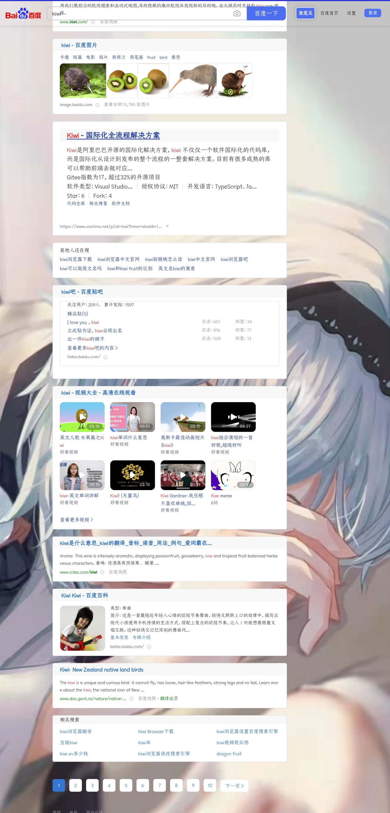

#### 以下代码直接复制粘贴到 附加10-自定义样式

```cpp
/**计数器的颜色样式*/
div .AC-CounterT{
    background: #FD9999;
}
/**右侧栏的样式-其实不开启更好看一些*/
#content_right{
    padding: 20px 15px 15px;
    border-radius: 5px;
    background-color: #fff;
    box-sizing: border-box;
    box-shadow: 0 0 20px 2px rgba(0, 0, 0, .1);
    -webkit-box-shadow: 0 0 20px 2px rgba(0, 0, 0, .1);
    -moz-box-shadow: 0 0 20px 2px rgba(0, 0, 0, .1);
}
/****可以加一些自己的背景图片,替换引号内的内容为可外链的图片即可****/
body{
    background-repeat: repeat-y;
    background-size: 100%;
    background-attachment:fixed;
    background-image: url('https://s3.ax1x.com/2020/11/18/Dm6ex0.jpg');
}
/*****窗口背景的透明虚化效果*****/
body>#wrapper,body>.wrap,body>#main,body #appbar,body #hdtbSum{
    background: rgba(225,225,225,0);
}
body>#wrapper,body>.wrap,body>.wrapper_new #foot #help {
    background: rgba(225,225,225,0);
}
body>#wrapper,body>.wrap,body>.wrapper_new #foot {
    background: rgba(225,225,225,0);
}
body>#wrapper,body>.wrap,body>.wrapper_new .sam_newgrid~#page {
    background: rgba(225,225,225,0);
}
body>#wrapper,body>.wrap,body>#main,body #appbar,body .f6F9Be {
    background: rgba(225,225,225,0);

}
body #head {
    background-color: rgba(225,225,225,0);
}
form.fm .s_ipt_wr.bg {
    background: #fff0
}
body>.minidiv .sfbg {
    background: #b3b3b354;
}
body>.minidiv .RNNXgb {
    background: #b3b3b354;
}
/**隐藏首页的大图标-修复可能导致外援样式异常**/
body[baidu] #s_lg_img_new{
    display:none !important;
}
#wrapper #content_left .result, #wrapper #content_left .c-container{
    border-radius: 5px;
}
```
### 代码预览样图


### 添加手机版，kiwi浏览器支持

```cpp
/**计数器的颜色样式*/
div .AC-CounterT{
    background: #FD9999;
}
/**右侧栏的样式-其实不开启更好看一些*/
#content_right{
    padding: 20px 15px 15px;
    border-radius: 5px;
    background-color: #fff;
    box-sizing: border-box;
    box-shadow: 0 0 20px 2px rgba(0, 0, 0, .1);
    -webkit-box-shadow: 0 0 20px 2px rgba(0, 0, 0, .1);
    -moz-box-shadow: 0 0 20px 2px rgba(0, 0, 0, .1);
}
/****可以加一些自己的背景图片,替换引号内的内容为可外链的图片即可****/
body{
    background-repeat: no-repeat;
    background-size: cover;
    left:0;
    top:0;
    right:0;
    botton:0;
    background-position:center;
    background-attachment:fixed;
    background-image: url('https://z3.ax1x.com/2021/05/30/2EX7QA.jpg');
}
/*****窗口背景的透明虚化效果*****/
body>#wrapper,body>.wrap,body>#main,body #appbar,body #hdtbSum{
    background: rgba(225,225,225,0);
}
body>#wrapper,body>.wrap,body>.wrapper_new #foot #help {
    background: rgba(225,225,225,0);
}
body>#wrapper,body>.wrap,body>.wrapper_new #foot {
    background: rgba(225,225,225,0);
}
body>#wrapper,body>.wrap,body>.wrapper_new .sam_newgrid~#page {
    background: rgba(225,225,225,0);
}
body>#wrapper,body>.wrap,body>#main,body #appbar,body .f6F9Be {
    background: rgba(225,225,225,0);

}
body #head {
    background-color: rgba(225,225,225,0);
}
form.fm .s_ipt_wr.bg {
    background: #fff0
}
body>.minidiv .sfbg {
    background: #b3b3b354;
}
body>.minidiv .RNNXgb {
    background: #b3b3b354;
}
/**隐藏首页的大图标-修复可能导致外援样式异常**/
body[baidu] #s_lg_img_new{
    display:none !important;
}
#wrapper #content_left .result, #wrapper #content_left .c-container{
    border-radius: 5px;
}
```

### 代码预览样图


