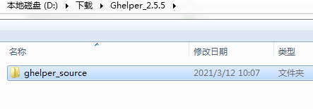
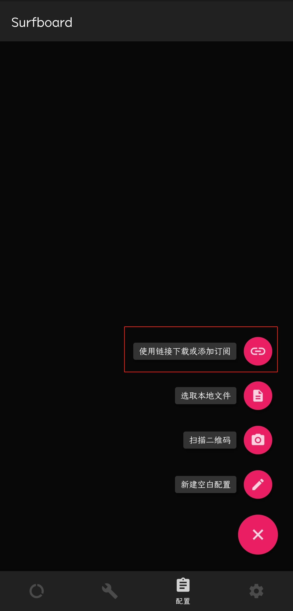

### 目录

### 1.安装谷歌浏览器

### 2.安装谷歌上网助手（Ghelper）

### 3.注册购买

### 4.其他代理方式

------

### 1.安装谷歌浏览器

在线安装官网：[https://www.google.cn/intl/zh-CN/chrome/](https://www.google.cn/intl/zh-CN/chrome/ "谷歌浏览器")

离线安装官方：[https://www.google.cn/intl/zh-CN/chrome/?standalone=1&platform=win64](https://www.google.cn/intl/zh-CN/chrome/?standalone=1&platform=win64 "谷歌浏览器离线安装")
>在正常官网地址后面添加：

`?standalone=1&platform=win64`

离线安装网址的解释，"?standalone=1"指离线安装包，"platform=win64"指64位Windows 版本,

如果加上的只是“?standalone=1”可以用来下载32位的Chrome离线包。
用“mac”替换“win”，就可以下载 Mac 版本.

### 2.安装谷歌上网助手（Ghelper）

官方网站：[http://googlehelper.net/](http://googlehelper.net/ "谷歌上网助手（Ghelper）")

下载之后解压待用，

打开你的Chrome浏览器-更多工具-扩展程序页面，或者

直接在网址输入: **chrome://extensions/**

这个页面点击 "添加已解压的扩展程序",如果没有，在右边有一个 “开发者模式” 开关，打开.

选择本次下载包里的 ghelper_source 目录,确认后就行了.

    
[notice]Tips：建议装上源码包后，利用免费节点去[Chrome应用商店](https://chrome.google.com/webstore/ "Chrome应用商店") 找到正式在线版本.安装正式线上版本后，回到扩展页面把刚才导入的已解压的包删除掉或停止.[/notice]

### 3.注册购买

Ghelper未注册提供免费线路：

注册购买会员

目前连接仅支持支付宝。

### 4.其他代理方式

目前支持以下平台使用代理：*需要达到一定的等级开放其他平台代理*,等级v3

IOS

Android

Windows

MAC OS

Linux

比如，安卓用户，点击相应的平台，下载V2RayNG APP，

点击相应的平台后会有订阅地址，复制订阅地址至手机，点击APP左上角 

订阅设置-右上角 + 粘贴订阅地址后，点击配置文件，右上角...更新订阅。

------

最近更新代理软件——Surfboard，是目前安卓平台下支持协议最多速度表现最好的，支持了HTTPS代理.

#### 使用方法:
打开surfboard 后,点底部第三个图标【配制】->点右上角红色按钮-> 出现菜单里选第一个

【使用链接下载】,会弹窗一个输入框，,粘上Surfboard的传用配制URL，点确定,等一会会下载成

功，会显示出所有的配制信息,这时再点右下角的确定按钮保存。保存时会让你输入个名称，写

Ghelper 就行了。使用时，是进入第二个图标，选一个线路。然后点第一个图标右上角连接。

------

[notice]小道消息：Ghelper软件作者正在开发桌面端APP，全网下架插件下载，已安装不受影响。关注本博客第一时间发布最新测试版，请期待！[/notice]
#### [有问题请联系我！](https://arley.cn/about/)
#### [想白嫖?点我](https://t.me/joinchat/_SW79Fthzds3NmI1)
#### [资源链接：密码:782a](https://arley.lanzous.com/b01bgw06h)
