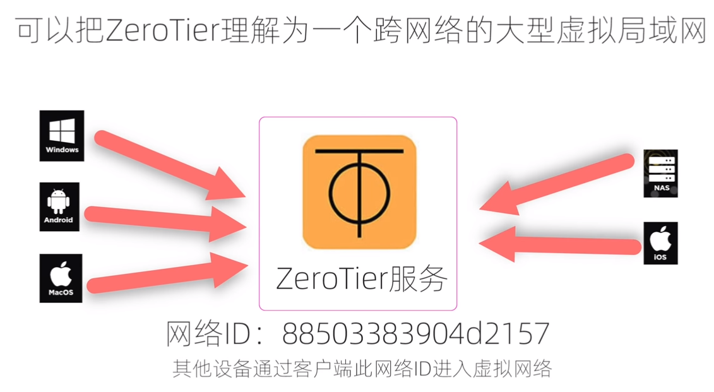
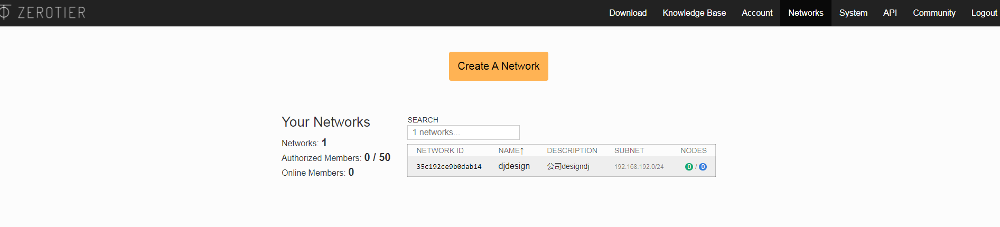
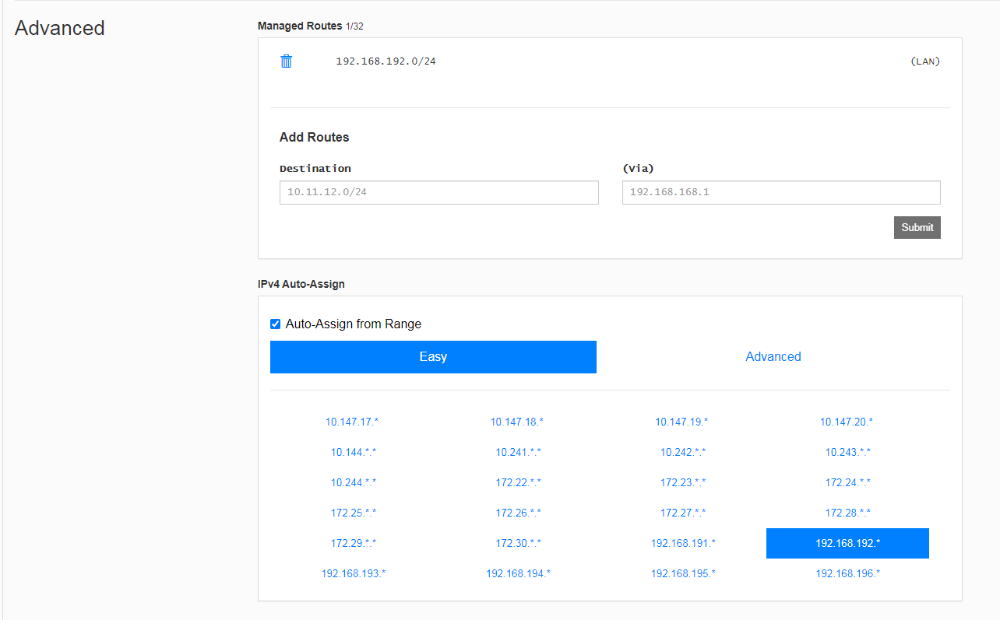
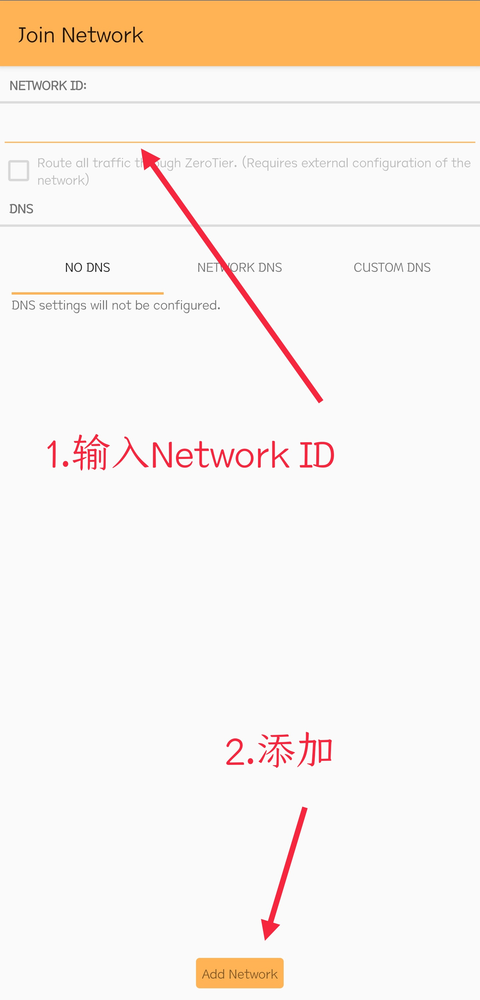

### 如何使用ZeroTier（<https://zerotier.com/>）

  支持 Github、Google、Microsoft 登录

  注册登录后，如下图，创建一个Network，

  名称简介随意，备注方便浏览，个人使用建议需要认证授权，共享给他人可以选择 Public模式，比如自建私有云共享文件影视资源。

  这里IP随意选择，其他未说明为默认。

  

  ZeroTier支持全平台，安装相对应的平台来加入您建立的局域网络。
  其它选项默认。

  ### 安卓端（<https://apkpure.com/cn/zerotier-one/com.zerotier.one>）

  添加完成后启用，然后去网页勾选授权添加的设备

------

#### [完整视频版请点ZeroTier内网穿透Youtube教程](https://www.youtube.com/watch?v=4dqDOkI8VE4&t=228s "ZeroTier内网穿透Youtube教程")

#### [资源链接 密码:4ewr](https://arley.lanzoui.com/b01ceesrc "ZeroTier内网穿透Youtube教程")
